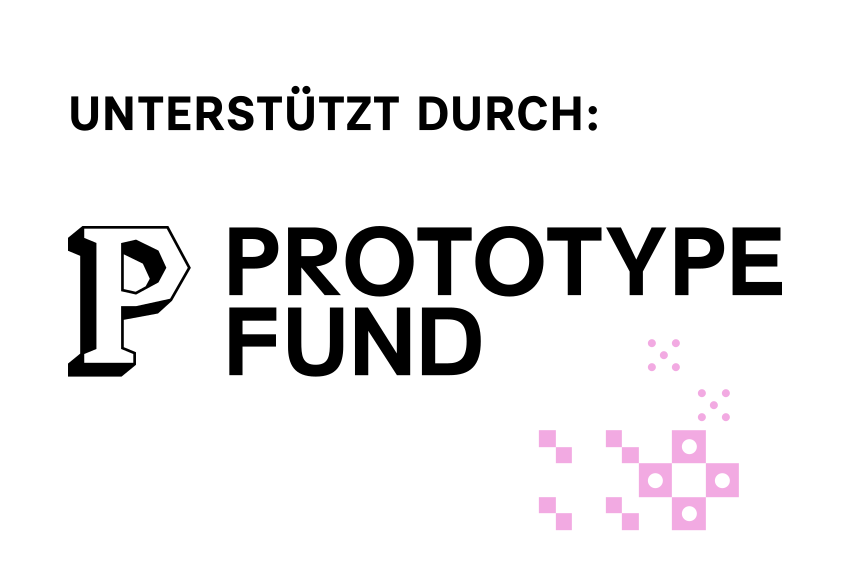

<p align="center">
  
</p>

<h1 align="center">PyConnectedness</h1>

<p align="center">
  
  
  
</p>

> ⚠️ **Active development.** This library is in an early stage. The API and
> structure will change, and the first modules are being added over the coming
> weeks.

## About

**[PyConnectedness](https://www.prototypefund.de/projects/pyconnectedness)** is a Python library for 
analysing dependence and spillovers across multivariate (time series) data. The goal is to bring 
methods that are well established in econometrics and statistics, but still scattered or missing
in Python, into one open-source package.

Planned scope includes:

- **Connectedness and spillover analysis** in the spirit of the Diebold-Yilmaz
  framework (variance-decomposition–based directional and net spillovers,
  including dynamic and frequency-domain variants).
- **Max-linear Bayesian networks** — graphical models on directed acyclic graphs
  for modelling extremal dependence and causal structure between extreme events.
- Network representation and visualisation of the estimated dependence structures.

## Planned repository structure

```
pyconnectedness/
├── README.md
├── LICENSE                     # GPLv3
├── CONTRIBUTING.md
├── pyproject.toml              # packaging & dependencies
├── .gitignore
├── .github/
│   └── workflows/
│       └── tests.yml           # continuous integration
├── src/
│   └── pyconnectedness/        # the library source code
│       ├── __init__.py
│       ├── connectedness/      # Diebold-Yilmaz spillover measures
│       ├── maxlinear/          # max-linear Bayesian networks
│       └── viz/                # network plotting
├── tests/                      # unit tests
├── examples/                   # example notebooks
├── logos/                      # project & funding logos
└── docs/                       # documentation
```

## References

The methods draw on, among others:

- Diebold and Yilmaz (2012, 2014) for *variance-decomposition-based connectedness and spillover measures*
- Baruník and Křehlík (2018) for *frequency-domain connectedness*
- Gissibl and Klüppelberg (2018) for *max-linear models on directed acyclic graphs* 

(Reference list to be completed as the modules are implemented.)

## Funding

Developed with support from the **Prototype Fund** (Software Sprint), funded by
the German Federal Ministry of Research, Technology and Space (BMFTR) and
supported by the Open Knowledge Foundation Deutschland.

<p align="center">
  
  &nbsp;&nbsp;&nbsp;
  
</p>

## License

Released under the [GNU General Public License v3.0](LICENSE).
